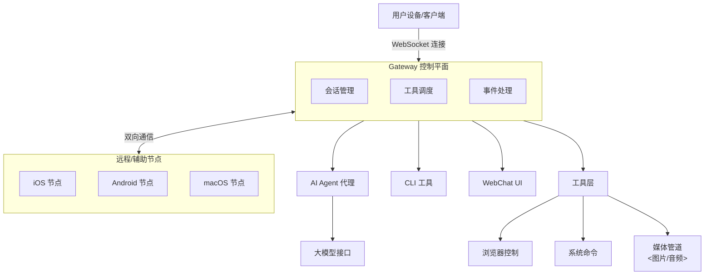

### 🦞 OpenClaw — 个人 AI 助手核心指南

> **文档状态**：已校对 | **版本**：v1.0
> **说明**：本指南基于原始 README 重构，已过滤非核心信息，优化技术术语翻译，并增加了架构图与导航。

---

### 📑 文档导航 (Breadcrumb)

-   [1. 产品概述与核心理念](#1-产品概述与核心理念)
-   [2. 核心功能与特性](#2-核心功能与特性)
-   [3. 支持的平台与应用 (归纳版)](#3-支持的平台与应用-归纳版)
-   [4. 系统架构与工作流 (图表)](#4-系统架构与工作流)
-   [5. 安装与运行环境](#5-安装与运行环境)
-   [6. 安全模型](#6-安全模型)

---

### 1. 产品概述与核心理念

**OpenClaw** 是一款**个人 AI 助手**，其核心理念是**“本地运行、始终在线、多端互联”**。

*   **本地优先 (Local-first)**：它不是一个云端的 SaaS 服务，而是运行在你自己的设备（macOS, Linux, Windows WSL2）上的网关（Gateway）。
*   **统一控制**：它像一个中枢，连接你常用的通讯渠道（WhatsApp, Telegram, Slack 等），让你在一个地方管理所有的 AI 交互。
*   **不仅仅是聊天**：它不仅能聊天，还能控制你的浏览器、执行系统命令、进行语音交互，甚至渲染实时的可视化画布（Canvas）。

---

### 2. 核心功能与特性

OpenClaw 的功能非常强大，主要可以分为以下几个维度：

| 功能模块 | 描述 | 纠错/说明 |
| :--- | :--- | :--- |
| **多通道收件箱** | 支持 WhatsApp, Telegram, Slack, Discord, Signal 等 20+ 平台。 | 原文 "Inbox" 译为“收件箱”更符合邮件/消息管理场景。 |
| **语音交互** | 支持 **语音唤醒 (Voice Wake)** 和 **对话模式 (Talk Mode)**。 | macOS/iOS 支持唤醒词；Android 支持连续语音。 |
| **实时画布** | 代理驱动的可视化工作区 (**Canvas**)，支持 A2UI 技术。 | 这里的 "Canvas" 不是 HTML 的 Canvas，而是一个特定的 UI 渲染层。 |
| **工具自动化** | 浏览器控制、定时任务 (Cron)、系统通知、截图等。 | 强调其“执行能力”，不仅仅是问答。 |
| **远程访问** | 通过 Tailscale 或 SSH 隧道安全地远程管理网关。 | 解决了“只能本地访问”的痛点。 |

---

### 3. 支持的平台与应用 (归纳版)

原始文档列出了海量的 App，为了方便你理解，我将其归纳为三类：

#### A. 核心推荐 (主流应用)
这些是你最可能用到的，且集成度最高的平台：

*   **即时通讯**：WhatsApp, Telegram, Signal, Discord, Slack, Google Chat。
*   **苹果生态**：iMessage (原生/BlueBubbles 桥接)。
*   **安卓生态**：Android (原生节点)。

#### B. 企业/团队协作
如果你在工作中使用：

*   **Microsoft Teams**：企业办公。
*   **飞书 (Feishu)**：国内/国际团队协作。
*   **Matrix / Mattermost**：开源/自托管团队通讯。

#### C. 扩展/小众平台 (一览表)
*注：以下平台虽支持，但除非你有特定需求，否则无需关注。*

| 类别 | 平台列表 |
| :--- | :--- |
| **社交/直播** | Twitch, LINE, Zalo, Nostr |
| **传统/其他** | IRC, BlueBubbles (iMessage桥), WebChat |
| **NAS/私有化** | Synology Chat, Nextcloud Talk |

---

### 4. 系统架构与工作流

为了让你直观理解它是如何工作的，我根据文档描述绘制了以下架构图。





**架构解析：**
1.  **Gateway (网关)**：这是核心，运行在你的 Node.js 环境中，负责所有连接和调度。
2.  **Agent (代理)**：负责与大模型（如 GPT-4, Claude）交互，处理逻辑。
3.  **Nodes (节点)**：这是 OpenClaw 的亮点。如果你的网关运行在 Linux 服务器上，你可以通过 WebSocket 将 macOS 或 Android 设备连接为“节点”，从而利用这些设备的本地能力（如麦克风、摄像头、系统权限）。

---

### 5. 安装与运行环境

**运行时要求**：
*   **Node.js**：版本 ≥ 22。
*   **包管理器**：支持 npm, pnpm, 或 bun。
*   **操作系统**：
    *   **推荐**：macOS, Linux。
    *   **支持**：Windows (需通过 WSL2，强烈推荐)。

**安装命令 (推荐)**：
```bash
# 全局安装 OpenClaw CLI
npm install -g openclaw@latest

# 运行入门向导（会自动安装网关守护进程）
openclaw onboard --install-daemon
```

---

### 6. 安全模型

OpenClaw 非常重视安全，默认配置下将入站私信（DM）视为**不可信输入**。

*   **配对机制 (Pairing)**：默认情况下，陌生人给你发消息，机器人不会直接执行，而是要求输入配对码（Pairing Code）。
*   **白名单**：只有通过验证的用户才会被加入白名单。
*   **沙盒模式**：对于群组（非主会话），可以配置在 Docker 沙盒中运行，限制 `bash` 等危险命令的执行，防止系统被破坏。

---

### 💡 总结建议

这份文档已经去除了原始文件中的冗余信息（如贡献者列表），修正了可能存在的翻译歧义，并通过图表和归纳表格让你能快速抓住 OpenClaw 的核心价值：**它是一个让你把 AI 助手部署在自己家里服务器/电脑上，并连接你所有社交软件的“瑞士军刀”。**
